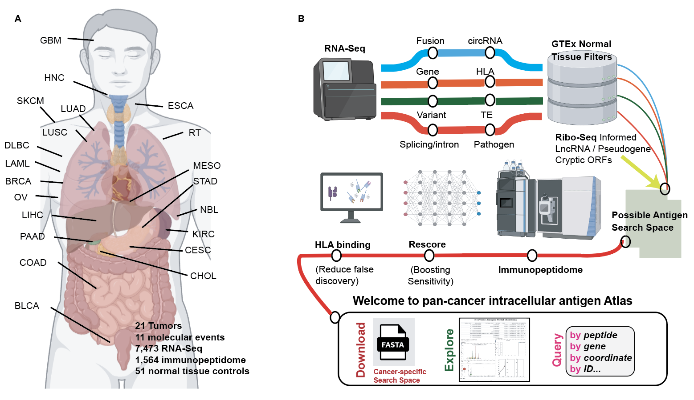

# ImmunoVerse
Accompanying codes for pan cancer atlas of intracellular tumor antigens

# Notes

* Codes for generating the figures in the manuscript can be found [scripts](./scripts).

* The whole [ImmunoVerse pipeline](https://docs.google.com/presentation/d/1l66tpNRdFWWut33G6rKZaKtASeh96kiIOERkDgfNzsg/edit?usp=sharing) have been 
deployed to Cancer Genome Cloud (CGC) as modularly designed docker, no single line of code required. 

* We also provide standalone version of ImmunoVerse, feel free to send us an inquiry

* [Whole molecular catalogues](./notes/molecular_catalogue.md) and [search space](./notes/search_space.md) for each cancer, along with [normal controls](./notes/normal.md) are released.

* [Corresponded search space nucleotide sequence and genomic mapping](./notes/search_space_nt.md) are released as well.

* We released all [Raw MS results](./notes/raw_ms_result.md) to enable reanalysis using different analytical procedures (i.e. tuning FDR stringency).

* We released and continue to curate [all public tumor immunopeptidome data](https://genome.med.nyu.edu/public/yarmarkovichlab/ImmunoVerse/ImmunoVerse_Hub/), please email us if we missed your dataset and we can include. Last update: `2025/10/28`

* Web portal are live (Watch [tutorial video](https://www.youtube.com/watch?v=olhNYVycJ2w)):

    * [Immunoverse Heroku App](https://immunoverse-web-5ef5cdbdcedf.herokuapp.com/). You can type in 
      PHOX2B peptide `QYNPIRTTF` or source gene `MYCN` to view
    * [Immunoverse CGC App](https://cgc.sbgenomics.com/webapps). Start ImmunoVerse with 2-3 minutes for launching.

# Citation

Li, Guangyuan*, Omar U. Guzmán-Bringas, Aman Sharma, Maxence Dellacherie, Palak Sekhri, Rachel Yamin, Dejan Stepec, et al. 2025. “A Pan-Cancer Atlas of Therapeutic T Cell Targets.” bioRxiv. https://www.biorxiv.org/content/10.1101/2025.01.22.634237v2 

Manuscript in submission

# Contact

Guangyuan(Frank) Li

Email: guangyuan.li@nyulangone.org

Postdoc, Perlmutter Cancer Center

NYU Grossman School of Medicine

