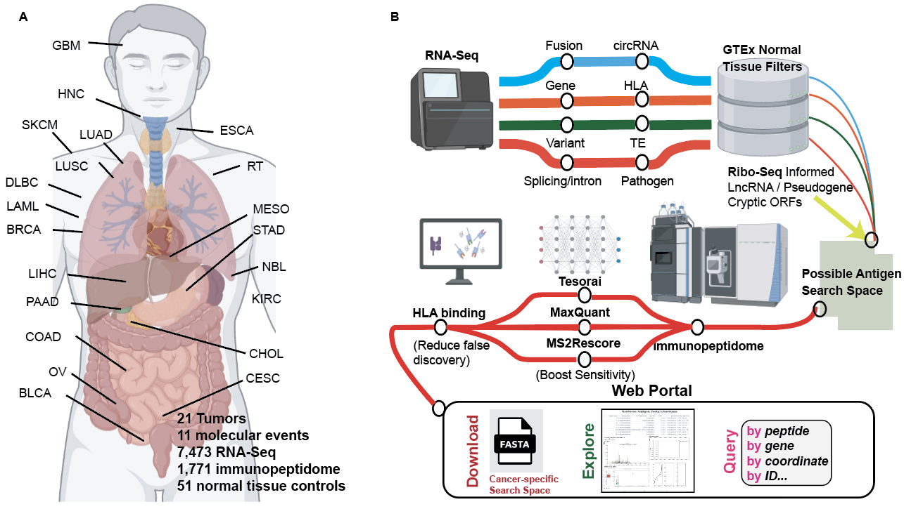

# pan_cancer_intracellular_antigen_atlas
Accompanying codes for pan cancer atlas of intracellular tumor antigens

# Notes

* Codes for generating the figures in the manuscript can be found [scripts](./scripts).

* Pipeline for generating sample-specific search space are deployed to [Cancer Genome Cloud (CGC)](https://cgc.sbgenomics.com/home).

* Web portal will be hosted on NYULH server.

* Other scripts can be requested by emailing us.

# Contact

Guangyuan(Frank) Li

Email: guangyuan.li@nyulangone.org

Postdoc, Perlmutter Cancer Center

NYU Grossman School of Medicine

