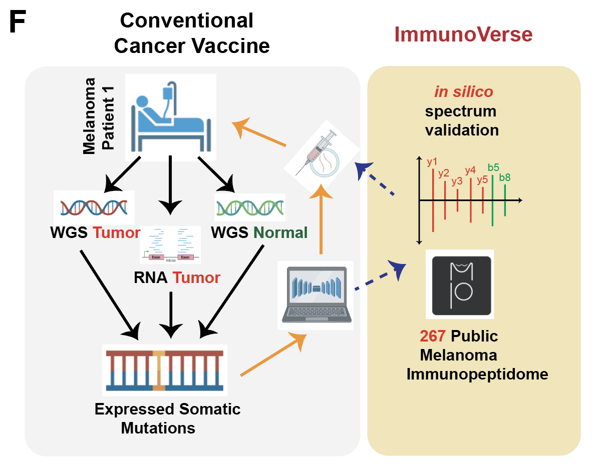
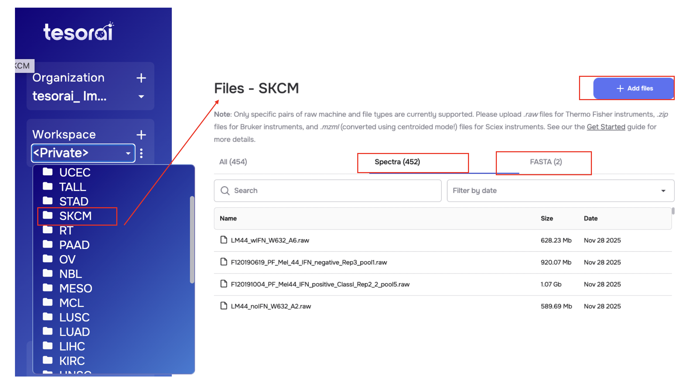
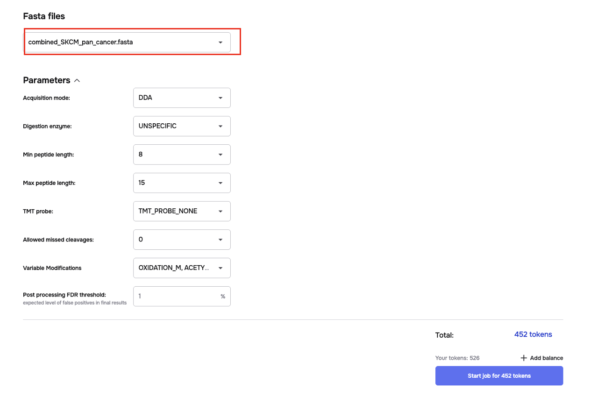

# Validating vaccine candidates by Immunopeptidome (using Tesorai)

We provided a pipeline to validate whether any vaccine targets can be empirically evidenced from large-scale public Immunopeptidome data. We listed steps for using this function

  

### Step 1: Fasta File

You shall have a list of antigen peptide sequence as fasta files, and let's say you are interested in melanoma (SKCM), you shall append this list with [our search space](https://genome.med.nyu.edu/public/yarmarkovichlab/ImmunoVerse/search_space_tesorai/SKCM/db_fasta_tesorai/). You don't need to use all aberrations, you can only use the canonical one (ensembl_protein.fasta) if desirable. Lastly, add [contaminants fasta](https://genome.med.nyu.edu/public/yarmarkovichlab/ImmunoVerse/database/contaminants_polish.fasta). 

Essentially, you just combine all fasta together, this can be easily done by manual copy-and-paste, or linux command `cat`, or your favorate coding language, let's assume after this step, you shall have a fasta named `combined_SKCM_pan_cancer.fasta`.

### Step 2: Upload Fasta file to Tesorai platform

We host all public raw files on [Tesorai platform](https://console.tesorai.com/) under `tesorai_immunoverse` project, you shall follow the instructions on creating an account. If you don't have access to the workspace, email me (li2g2@mail.uc.edu) or the tesorai support. 

Now, upload your fasta file to the project and SKCM workspace.

  

### Step 3: Run Tesorai

Now, just easily submit the job, and the search results will be sent to your email once finished, it takes about 1 hour!

  

  

### Step 4: in silico validation of candidates

You can follow our [CGC pipeline](https://docs.google.com/presentation/d/1l66tpNRdFWWut33G6rKZaKtASeh96kiIOERkDgfNzsg/edit?slide=id.g33cf7e06783_0_3#slide=id.g33cf7e06783_0_3) to conduct in silico validation on the fly.

