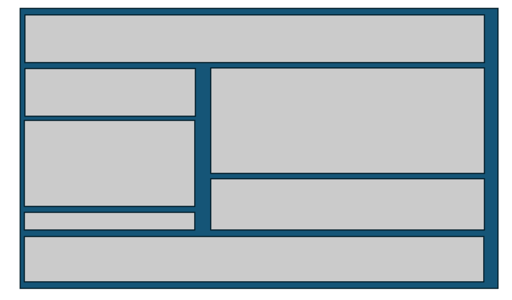

# How do I normally think about web layout

I first always think about a page consisting of a bunch of `div`, no matter what will go inside the it.



# Dash python code

Try to write the `app.layout` from a top-down manner.

```python
from dash import Dash, Input, Output, callback, dash_table, html, dcc, State
import dash

app = Dash(__name__,assets_folder='./assets')
app.title = 'web_name'

app.layout = html.Div(
    [
        html.Div(className='header_div'),
        html.Div(className='middle_div'),
        html.Div(className='footer_div')
    ]
className='main_div')

host = subprocess.run(['hostname'],stdout=subprocess.PIPE,universal_newlines=True).stdout.split('\n')[0]
port = 8050
app.run(host=host,port=port)
```

Now you can expand it:

```python
app.layout = html.Div(
    [
        html.Div(className='header_div'),
        html.Div([
            html.Div(className='middle_left_div'),
            html.Div(className='middle_right_div')
        ],className='middle_div'),
        html.Div(className='footer_div')
    ]
className='main_div')
```

Then further expand:

```python
app.layout = html.Div(
    [
        html.Div(className='header_div'),
        html.Div([
            html.Div([
                html.Div(className='middle_left_top_div'),
                html.Div(className='middle_left_middle_div'),
                html.Div(className='middle_left_bottom_div')
            ],className='middle_left_div'),
            html.Div([
                html.Div(className='middle_right_top_div'),
                html.Div(className='middle_right_bottom_div')
            ],className='middle_right_div')
        ],className='middle_div'),
        html.Div(className='footer_div')
    ],
className='main_div')
```

# CSS code

Again, top down manner, and I always put inside element right after their parental

```css
.main_div {
    display:flex;
    flex-direction: column;
    width: 100%;
    height: 100vh;
}

.header_div {
    flex:2;
    min-height:0;
    border: 2px solid grey;
}

.middle_div {
    flex:6;
    min-height:0;
    border: 2px solid grey;
    display: flex;
    flex-direction: row;
    border: 2px solid grey;
}

.middle_left_div {
    flex: 4;
    min-width: 0;
    min-height: 0;
    display: flex;
    flex-direction: column;
    border: 2px solid grey;
}

.middle_left_top_div {
    flex: 3;
    min-height: 0;
    border: 2px solid black;
}

.middle_left_middle_div {
    flex: 5;
    min-height: 0;
    border: 2px solid black;
}

.middle_left_bottom_div {
    flex: 1;
    min-height: 0;
    border: 2px solid black;
}


.middle_right_div {
    flex: 6;
    min-width: 0;
    min-height: 0;
    display: flex;
    flex-direction: column;
    border: 2px solid grey;
}

.middle_right_top_div {
    flex: 7;
    min-height: 0;
    border: 2px solid black;
}

.middle_right_bottom_div {
    flex: 3;
    min-height: 0;
    border: 2px solid black;
}


.footer_div {
    flex:2;
    min-height:0;
    border: 2px solid grey;
}
```

For certain dash element inside each div, they have their own spec, so the CSS code needs to be able to control them specifically, we can add notes in the below as I learn more

```css
.actual_logo {
    width:100%;
    height: 100%;
    object-fit: contain;
}

.run_button {
    flex: 0 0 30px;
    min-height: 0;
}

```