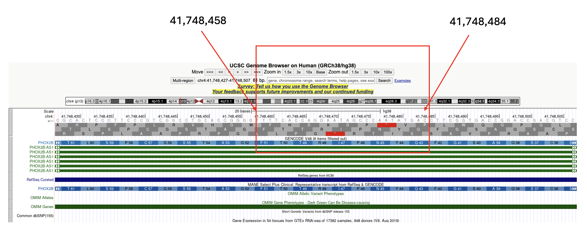

# Instructions on released search space (nucleotide and genome mapping)

Along with released peptide fasta for searching immunopeptiomic data, it would be helpful to know where these peptide fragments come from, where are they located in
genome. Although it is possible to perform BLAT to get possible mapping directly from peptide to genomic region, it does not always return a hit and even when it works, the BLAT may return partial mapping or incorrect mapping. In light of that, we release mapping tables connecting each peptide fragment to its coding sequence (cDNA) and the genomic regions where it gets generated to facilitate downstream analysis.

It is released [here](https://genome.med.nyu.edu/public/yarmarkovichlab/ImmunoVerse/search_space_tesorai_nt/), in each cancer, we have:

1. `canonical_protein.txt`
2. `fusion.txt`
3. `splicing.txt`: splicing and TE chimeric transcript
4. `intron.txt`
5. `nuorf.txt`: cryptic ORF, LncRNA, pseudogene
6. `TE_self_translate.txt`

The three fasta that are not able to map are `mutation`, `pathogen` and `uniprot_isoform`, the reason is, in the program, these fasta are not derived from genomic sequence, but rather from protein sequence. Particulary, `mutation` was derived by imputing the mutated residue (i.e. KRAS G12D), `pathogen` is directly downloaded from uniprot proteome, `uniprot_isoform` is also from Uniprot. 

To explain the tables, there are 4 columns:

1. `ID`, this can connect each record in fasta file to its genomic information in this table
2. `protein sequence`: continuous "protein" sequence
3. `cds`: cDNA sequence
4. `composition`: genomic regions for that features (multi-exons)

For second column, what I meant by `continuous` is you may see `*` (stop codon) in this column, when we generate the possible peptide fragments, we split "protein" by stop codon, so one feature/protein like below can give rise to 2 peptide fragments:

```bash
# continuous peptide sequence
AAAAAAAAAAA*AAAAAAAAAAAAAAAAAA

# give rise to two possible peptide fragments
>seq1
AAAAAAAAAAA
>seq2
AAAAAAAAAAAAAAAAAA
```

For genomic region, it follows `genome_assembly_version@exon;exon;exon`, the first exon will be exon 1, meaning the first exon that gets translated regardless of strands. For each `exon`, it follows `chrom:start-end:strand`, here the coordinate is always regard to forward strand, and `start` is always less than `end`.

`Note`: You may see some blank or unknown label in the table, representing some edge cases that are currently not supported yet, but we are working on that.

## How to get exact genomic location of an identified peptide?

These tables are extremely useful when you'd like to answer question like below:

I identified `QYNPIRTTF` from ID `ENSG00000109132|ENST00000226382|PHOX2B`, what are the exact genomic regions in which this peptide is generated?

You can do the following:

```python
query = 'QYNPIRTTF'
uid = 'ENSG00000109132|ENST00000226382|PHOX2B'
pep = 'MYKMEYSYLNSSAYESCMAGMDTSSLASAYADFSSCSQASGFQYNPIRTTFGATSGCPSLTPGSCSLGTLRDHQSSPYAAVPYKLFTDHGGLNEKRKQRRIRTTFTSAQLKELERVFAETHYPDIYTREELALKIDLTEARVQVWFQNRRAKFRKQERAAAAAAAAAKNGSSGKKSDSSRDDESKEAKSTDPDSTGGPGPNPNPTPSCGANGGGGGGPSPAGAPGAAGPGGPGGEPGKGGAAAAAAAAAAAAAAAAAAAAGGLAAAGGPGQGWAPGPGPITSIPDSLGGPFASVLSSLQRPNGAKAALVKSSMF'
cds = 'ATGTATAAAATGGAATATTCTTACCTCAATTCCTCTGCCTACGAGTCCTGTATGGCTGGGATGGACACCTCGAGCCTGGCTTCAGCCTATGCTGACTTCAGTTCCTGCAGCCAGGCCAGTGGCTTCCAGTATAACCCGATAAGGACCACTTTTGGGGCCACGTCCGGCTGCCCTTCCCTCACGCCGGGATCCTGCAGCCTGGGCACCCTCAGGGACCACCAGAGCAGTCCGTACGCCGCAGTTCCTTACAAACTCTTCACGGACCACGGCGGCCTCAACGAGAAGCGCAAGCAGCGGCGCATCCGCACCACTTTCACCAGTGCCCAGCTCAAAGAGCTGGAAAGGGTCTTCGCGGAGACTCACTACCCCGACATCTACACTCGGGAGGAGCTGGCCCTGAAGATCGACCTCACAGAGGCGCGAGTCCAGGTGTGGTTCCAGAACCGCCGCGCCAAGTTTCGCAAGCAGGAGCGCGCAGCGGCAGCCGCAGCGGCCGCGGCCAAGAACGGCTCCTCGGGCAAAAAGTCTGACTCTTCCAGGGACGACGAGAGCAAAGAGGCCAAGAGCACTGACCCGGACAGCACTGGGGGCCCAGGTCCCAATCCCAACCCCACCCCCAGCTGCGGGGCGAATGGAGGCGGCGGCGGCGGGCCCAGCCCGGCTGGAGCTCCGGGGGCGGCGGGGCCCGGGGGCCCGGGAGGCGAACCCGGCAAGGGCGGCGCAGCAGCAGCGGCGGCGGCCGCGGCAGCGGCGGCGGCGGCAGCGGCAGCGGCGGCAGCTGGAGGCCTGGCTGCGGCTGGGGGCCCTGGACAAGGCTGGGCTCCCGGCCCCGGCCCCATCACCTCCATCCCGGATTCGCTTGGGGGTCCCTTCGCCAGCGTCCTATCTTCGCTCCAAAGACCCAACGGTGCCAAAGCCGCCTTAGTGAAGAGCAGTATGTTC'
comp = 'hg38@chr4:41748370-41748610:-;chr4:41747349-41747536:-;chr4:41745810-41746322:-'

# which residue within the protein, 43th residue
pi = pep.find(query) + 1

# first nt of this peptide should be 127th nt
ni = (pi-1) * 3 + 1

# this peptide spans 127nt to 127+3*9-1=153nt
ni_e = ni + 3*(len(query)) - 1

# now traverse the genomics footprint
transcript_positions = []
accu = 0
for exon in comp.split('@')[1].split(';'):
    chrom,coord,strand = exon.split(':')
    start,end = coord.split('-')
    start,end = int(start),int(end)
    if strand == '-':
        for i in range(end,start-1,-1):
            if accu < ni-1:
                accu += 1
                continue
            elif accu >= ni-1 and accu < ni_e:
                transcript_positions.append(i)
                accu += 1
                continue
            elif i >= ni_e:
                break
print(transcript_positions)
# [41748484, 41748483, 41748482, 41748481, 41748480, 41748479, 41748478, 41748477, 41748476, 41748475, 41748474, 41748473, 41748472, 41748471, 41748470, 41748469, 41748468, 41748467, 41748466, 41748465, 41748464, 41748463, 41748462, 41748461, 41748460, 41748459, 41748458]
```

Let's do a sanity check:



