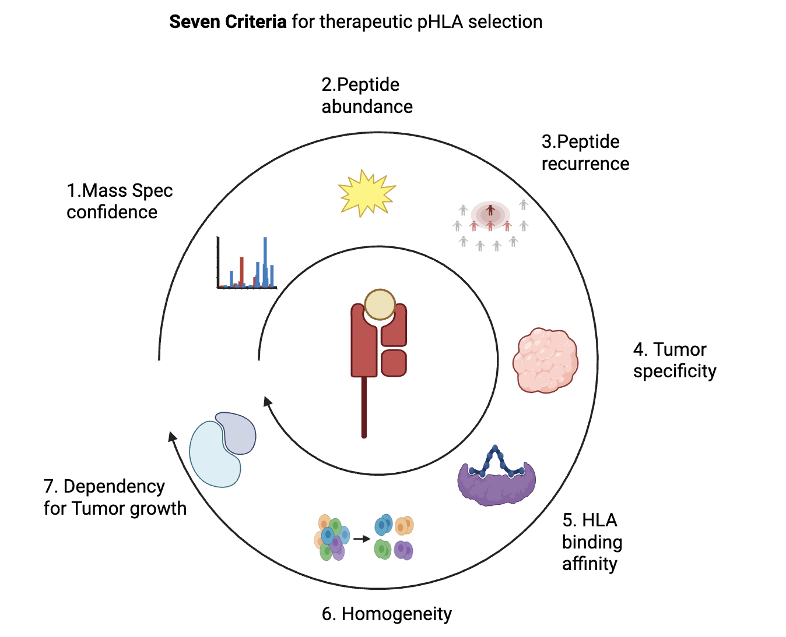

# Seven Criteria for therapeutic pHLA selection

1. `MS confidence`: the peptide must be evidenced from empirical MS study, not pure computational prediction

2. `Peptide Abundance`: the peptide needs to be abundant in tumor

3. `Peptide Recurrence`: the peptide needs to be recurrently detected in MS

4. `Tumor specificity`: Peptide must be only in tumor, absent in normal tissues

5. `Binding affinity`: Peptide needs to be tightly bound with cognate HLA

6. `Homogeneity`: Peptide needs to be homogeneous across tumor clones

7. `Dependency`: Source protein needs to be depenedent for tumor growth

